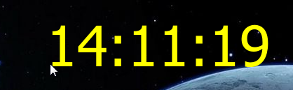
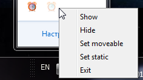

### DesktopClock
___

Digital clock (Desktop widget).

Requirements:
- Python 3.6
- PyQt5
- pymodbus
- numpy

**fig1. Widget**

**fig2. System Tray**

___
### How to create virtual environment
**Windows**
~~~bash
$ python -m venv env
$ source env/Scripts/activate
(env)$ python -m pip install --upgrade pip
(env)$ pip install -r requirements.txt
(env)$ deactivate
~~~
**Linux**
~~~bash
$ python3 -m venv env
$ source env/bin/activate
(env)$ python -m pip install --upgrade pip
(env)$ pip install -r requirements.txt
(env)$ deactivate
~~~
#### Executable file creation
**Windows** (DesktopClock.exe)
~~~bash
$ source env/Scripts/activate
(env)$ pyinstaller --clean --onefile --noconsole --icon=clock.ico --name DesktopClock ./main.py
(env)$ cp -r ./images dist/
(env)$ deactivate
~~~
**Linux**
~~~bash
$ source env/bin/activate
(env)$ pyinstaller --clean --onefile --noconsole --icon=clock.ico --name DesktopClock ./main.py
(env)$ cp -r ./images dist/
(env)$ deactivate
~~~
---
### How to use
~~~bash
$ source env/Scripts/activate
(env)$ python main.py
~~~
